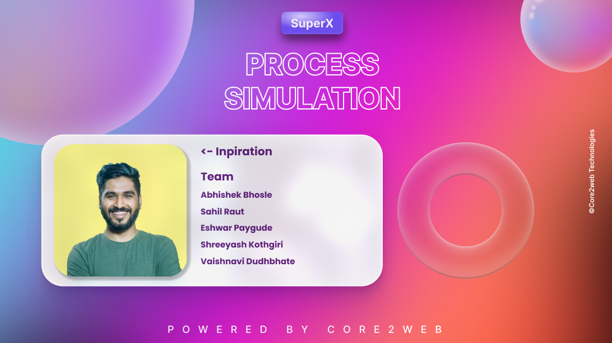

# 🚀 Process Simulation : JavaFX

The project aims to illustrate real-world or abstract processes through graphical representations, allowing users to visualize the step-by-step movement or changes in elements, providing an intuitive understanding of the underlying process.

